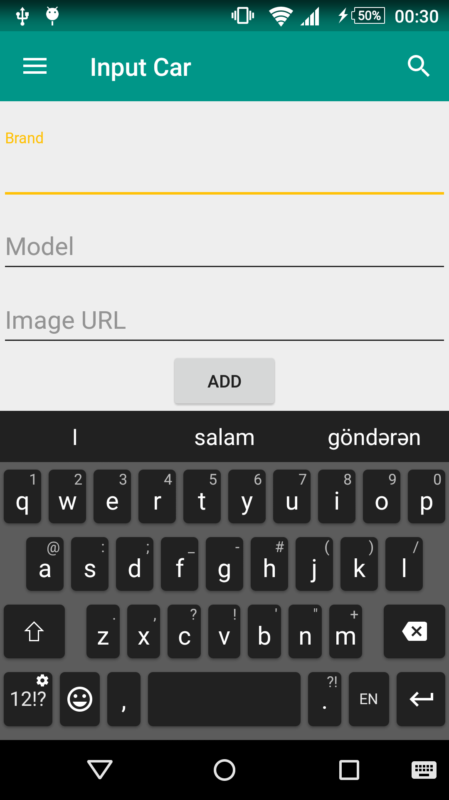
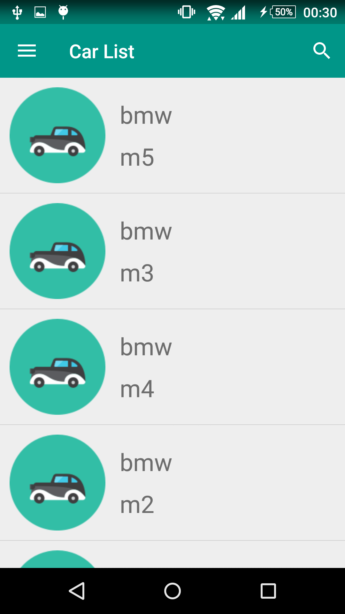
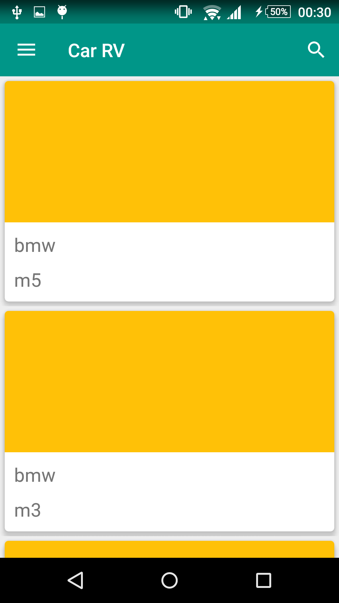
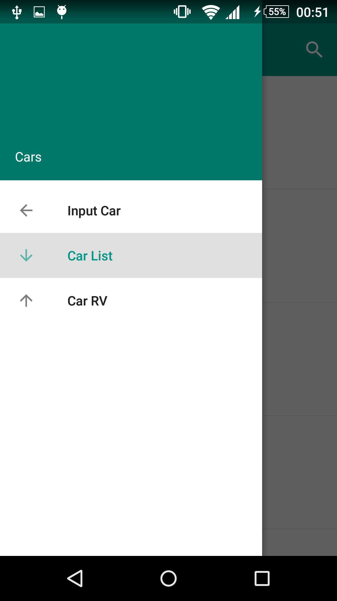
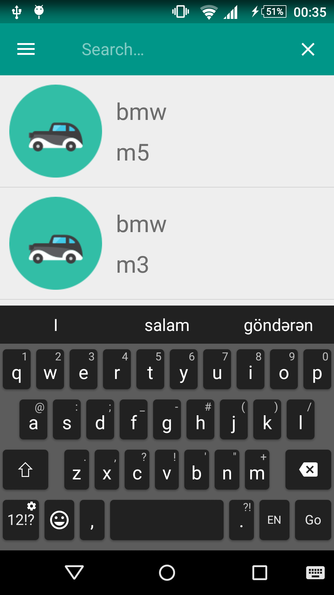
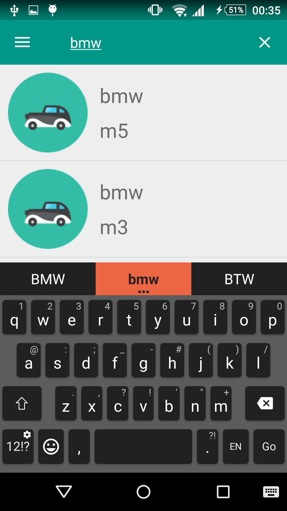
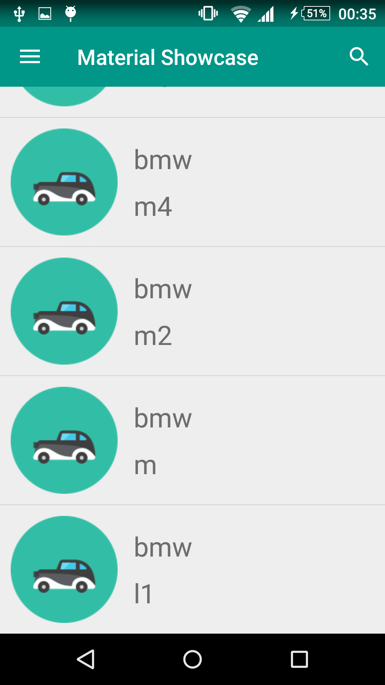

# android-material-example
Material design shown in android aapp.
 
##App's screenshots

###Adding data screen:

###Datas were shown with ListView element:

###Datas were shown with RecyclerView element:

###NavigationView:

###After click to search button on toolbar:

###Write smth for search:

###Result of search:

